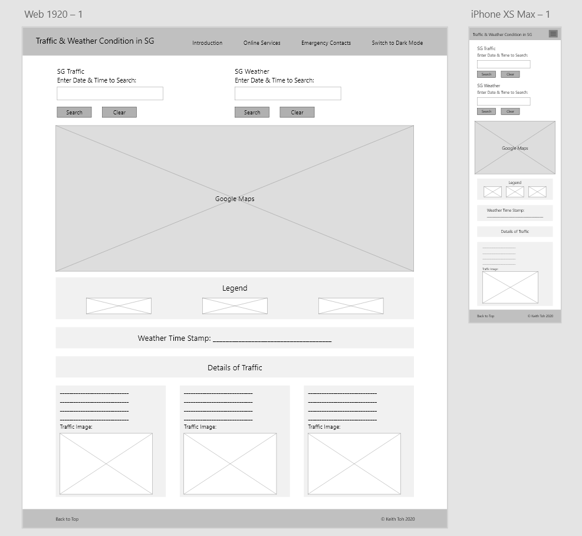

# ID_KeithToh_Assg2
### Keith Toh ID-03
#### Traffic & Weather Condition in Singapore
This Project allows users to check the traffic condition in Singapore based on traffic images displayed, as well as the rainfall value at different parts of Singapore.

__Link to GitHub Page: https://keithtohx.github.io/ID_KeithToh_Assg2/__

## Design Process
This website is intended for drivers, road users in general and those researching about traffic conditions and rainfall in Singapore. They will be able to know if the roads they would like to travel on is congested, and plan their journey accordingly if they wish to avoid the congestion. Users will also be able to know if a place is/was raining at certain dates and timings. All the users need to do is to enter the date and time which they want to search into the input boxes. This website will then show a map with all the location of traffic cameras and weather detector stations in operation, as well as the images taken by the cameras and the rainfall values.

This website is designed to have all the content be displayed in a linear layout. In terms of colour choice, a very light grey (#edf0f1) was chosen for the background colour of most content except the user input section, and white for the website background for light mode appearance. For dark mode appearance, different tones of grey were chosen to replace the background colours of light mode. 

User Stories:
* As a driver, I want to check if a certain section of the road is congested, so that I can better plan my journey to avoid reaching my destination late.
* As a driver, I want to check if a certain section of the road has a high rainfall value, so that I can decide if I want to travel using that road in case of flooding.
* As a researcher, I want to view traffic images captured at certain places at specific timings, so that I can determine the trend of vehicles driving past the places at those timings.
* As a researcher, I want to check if certain places rained at specific timings, so that I can determine the trend of rainfall in Singapore.

__Link to Adobe XD Wireframe: https://xd.adobe.com/view/160a2137-9de5-4af5-9391-7d3748a085d5-4359/__

* The Wireframe for this project was amended later in the design process to better reflect changes to the inital plan/design and include several new features.
  
## Features
### Existing Features 
* __Feature 1: Collapsible Hamburger Menu__
    * When Users view the website on a smaller screen, the navigation bar will collapse into a Hamburger Menu button so that the navigation bar will not occupy a larger display space.
* __Feature 2: Government Digital Services__
    * Users can access and use the Government Digital Services related to vehicle/driving by clicking on "Online Services" tab on the navigation bar and the website links shown. They will be redirected to a new page with the website opened. 
* __Feature 3: Emergency Hotlines/Contacts__
    * Users can view a list of Emergency Hotlines and Contacts by clicking on the "Emergency Contact" tab on the navigation bar.
* __Feature 4: User's Current Location on Google Maps__
    * Users will be able to view their own current location/ the location where the user are when viewing the website on the Google Maps on the website.
    * Click on the "Pan to Current Location" button on the top of the map to shift the view of the map so that the User's current location is in the centre. A marker pin will also be shown on the map to represent the User's current location.
* __Feature 5: Search for the Traffic Condition__
    * Users can search for the traffic condition in Singapore and traffic images by entering the date and time into the input box.
    * Output includes Location of Cameras on Map, Camera ID, Coordinates of Camera, Image of Traffic and Timestamp.
* __Feature 6: Search for the Weather Condition (Rainfall value)__
    * Users can search for the rainfall values in Singapore by entering the date and time into the input box.
    * Output includes Location of Weather Stations on Map, Device ID, Coordinates of Detectors and Timestamp.
* __Feature 7: Back to Top of Website__
    * Brings Users back to the Top of the Website by clicking on the "Back to Top" link at the bottom of the page.
* __Feature 8: Light/ Dark Modes Appearances__
    * Allows Users to switch the colour theme of the website between light and dark modes to have a different viewing experience by clicking on the "Switch to Light/Dark Mode" link on the navigation bar. 

## Technologies Used
* [JQuery](https://jquery.com)
    * This project uses jQuery to simplify DOM manipulation.
* [Bootstrap](https://getbootstrap.com/)
    * This project uses Bootstrap to layout contents on the website.
* __APIs__
    * [Data.gov.sg](https://data.gov.sg/)
        * This project uses Traffic Images and Realtime Weather Readings across Singapore (Rainfall) APIs from Data.Gov to retrieve images of the roads of Singapore and the locations of the traffic cameras and weather stations. 
    * [Google Maps](https://developers.google.com/maps/apis-by-platform)
        * This project uses Google Maps JavaScript API to display a Google Map on the website, as well as the exact locations of every traffic cameras and weather stations.

## Testing
1. __Scenario Testing:__
    1. __Search for Traffic/ Weather Details:__
        1. Scroll to the top of the website/ Click on the 'Back to Top' button at the bottom of the page.
        2. Verify that an error message about entering the datetime in the correct format appears when:
            * the input only has the date value (e.g. 2020-12-31);
            * the input only has the time value (e.g. 23:59:59); and
            * date and time entered are not in the specified format (e.g. without 'T', '-' or ':').
        3. Try entering the Date and Time in the correct format and verify that there are icons appearing on the Google Map after clicking on the "Search" button. This means that there are data retrieved. 
    2. __No Data Available in Database:__
        1. Scroll to the top of the website/ Click on the 'Back to Top' button at the bottom of the page.
        2. Enter a very recent date and time (e.g. current time) into the input box and click search.
        3. Verify that if there is no icons shown on the Google Maps, an error message will be shown instead saying that there is "No traffic details found. Try another Date & Time." for traffic images searches or "No rainfall values found. Try another Date & Time." for rainfall value searches.
        4. This means that the Data.Gov.sg database do not have the latest data updated into their database.
        5. Try entering a date which is at least a week ago from the current date and verify that there are icons appearing on the Google Map after clicking on the "Search" button. This means that there are data retrieved. 
2. __Different Screen Sizes:__
    * When viewed on a big screen (desktop):
        * Navigation bar options will all be displayed out.
        * The user input section will be displayed horizontally.
    * When viewed on a small screen (smartphone):
        * Navigation bar options will collapse into a hamburger menu button.
        * The user input section will stack vertically.
3. __Interesting Bugs/ Problems:__
    1. When the user search for both the traffic images and weather, and tries to remove the results of the weather first, the user will then not be able to remove the results of the traffic condition unless the website is being refreshed.
    2. When the user switch the website appearance from light mode to dark mode before searching for the traffic images or rainfall value, the background colour of the traffic and weather details will be displayed in light mode colour theme. However, this can be solved by returning to light mode and then back to dark mode.
4. __Validation:__
    The following websites were used to test the HTML, CSS and JS codes:
    1. HTML Code: [W3C MarkUp Validator](https://validator.w3.org/)
    2. CSS Code: [W3C CSS Validation](https://jigsaw.w3.org/css-validator/)
    3. Javascript Code: [JSHint](https://jshint.com/)
5. __Manual User Testing:__ [Documentation on Google Sheets](https://docs.google.com/spreadsheets/d/1ZACe1F2ptL2ZhsXDKxCKH8pRRk56mJ1204Lcjidpfog/edit?usp=sharing)

## Credits
### Media/ Content
* Icons used in the Google Maps: [Google Earth/Maps Icons](http://kml4earth.appspot.com/icons.html#shapes)
* Text Fonts used in website: [Google Fonts](https://fonts.google.com/)
* Navigation Bar: [Bootstrap Documentation](https://getbootstrap.com/docs/5.0/components/navbar/)
* Codes for User Current Location on Google Maps: [Google Maps Platform Documentation](https://developers.google.com/maps/documentation/javascript/geolocation)
### Acknowledgements
* I received inspiration for Feature 8 (Light & Dark Modes) from various Smartphone Operating Systems (e.g. Apple iOS) which offers both Light Mode and Dark Mode appearances.